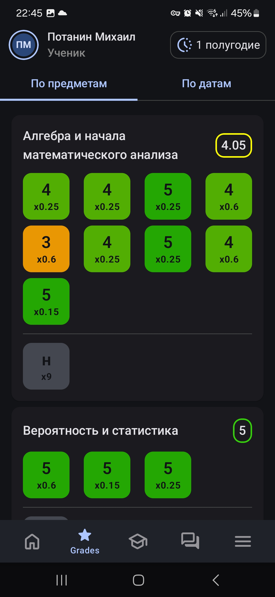
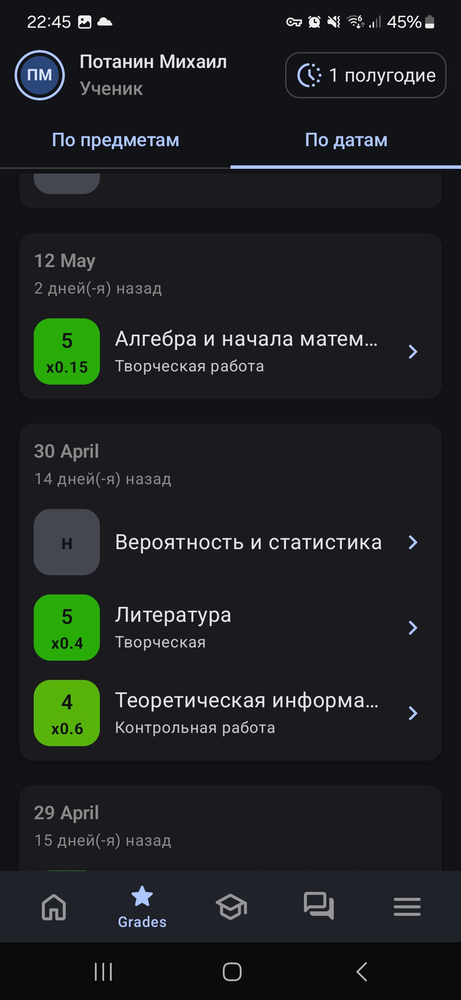

# NiceEljur

Современный Android-клиент для электронного дневника Eljur. Разработанный с использованием Kotlin и Jetpack Compose, это приложение предоставляет удобный интерфейс для доступа к школьному расписанию, домашним заданиям, оценкам и сообщениям.

## Возможности

    
    

    
    

### 📅 Умное расписание
- Календарь на неделю с удобной навигацией
- Подробная информация об уроках, включая номера кабинетов и время
- Наглядное отображение перемен между уроками
- Выделение выходных дней

[Скриншот расписания]

### 📚 Управление домашними заданиями
- Удобное отображение домашних заданий для каждого урока
- Поддержка прикрепленных файлов
- Визуальные индикаторы выполненных заданий

[Скриншот домашних заданий]

### 📊 Умная система оценок
- Два режима просмотра оценок: по предметам и по датам
- Интерактивные карточки оценок с цветовой индикацией:
  - Красный для оценок 1-2
  - Оранжевый для оценки 3
  - Светло-зеленый для оценки 4
  - Зеленый для оценки 5
- Информативные карточки предметов с:
  - Названием предмета
  - Средним баллом
  - Сеткой оценок с весовыми коэффициентами
  - Статистикой пропусков ("н") и опозданий ("ОП")
- Детальная информация по каждой оценке через нижний диалог:
  - Тип работы
  - Вес оценки
  - Дата получения
  - Комментарии учителя
- Удобное отображение оценок по датам с:
  - Группировкой по дням
  - Относительными датами ("Сегодня", "Вчера", "N дней назад")
  - Контекстной информацией о предмете и типе работы

[Скриншот оценок]

### 💬 Система сообщений
- Обмен сообщениями между пользователями системы
- Просмотр истории переписки

[Скриншот сообщений]

## Технические детали

Приложение построено на современных технологиях разработки для Android:
- 🛠 Kotlin + Jetpack Compose
- 🏗 Clean Architecture с разделением на модули
- 💉 Hilt для Dependency Injection
- 📦 Многомодульная архитектура
- 🌐 Эффективное взаимодействие с API (Retrofit + OkHttp) и кэширование
- 🔐 Безопасное хранение данных
- 🎨 Material 3 Design с поддержкой:
  - Динамических цветовых схем
  - Современных компонентов Material You
  - Адаптивных карточек и диалогов
  - Кастомных иконок
- 🌙 Поддержка тёмной темы
- 👤 Информативный UserInfoTopBar с отображением роли пользователя

## Установка

[Скоро будет доступно]

*NiceEljur является неофициальным клиентом системы Eljur и не связан с официальным сервисом Eljur.*
